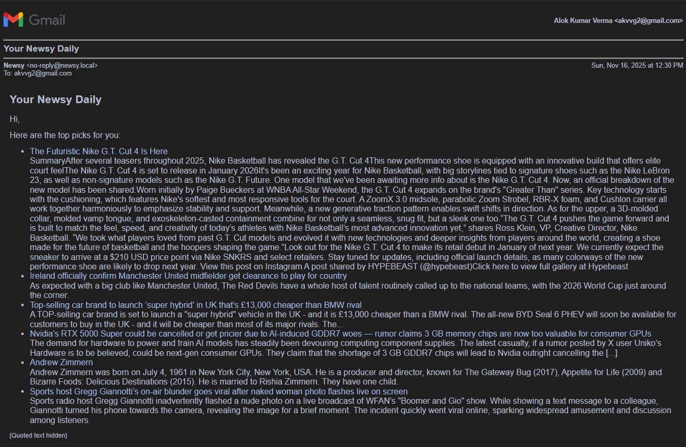

# Newsy 📰

A modern news aggregator with Spring Boot backend and Angular frontend that fetches news from NewsData.io API, displays on UI and also delivers newsletters to email subscribers.

## 🚀 Features

- 5 news categories with 4 articles each
- Daily scheduled news fetching at 8:00 AM UTC
- Dark/light theme with responsive design
- REST API endpoints for news retrieval
- Newsletter subscription (email)

## 📸 Snapshot


## 🛠️ Tech Stack

**Backend:** Java 21, Spring Boot 3.5.7, MongoDB Atlas, Maven  
**Frontend:** Angular 17, TypeScript, RxJS

## 🔔 Newsletter

This project includes a simple newsletter subscription system:

- Users can subscribe from the UI with their email and selected categories.  
- A scheduled job compiles top articles per subscriber and sends a daily email



Important notes about deployment and email sending:

- Local: the mail flow works locally if you provide valid SMTP env variables.
- Deployment: Render (free tier) blocks outbound SMTP. Because of this, email sending fails even if it works locally. 

## 📋 Quick Start

**Prerequisites:** Java 21, Maven 3.8+, Node.js 18+, MongoDB Atlas, NewsData.io API Key

```bash
# Clone & configure
git clone <your-repo-url>
cd newsy
cp .env.example .env  # Add your MongoDB URI and NewsData.io API key

# Run backend (http://localhost:8080)
mvnw clean install
mvnw spring-boot:run

# Run frontend (http://localhost:4200)
cd newsy-ui
npm install && npm start
```

## 🌐 API Endpoints

- `GET /api/news` - Get all news grouped by category
- `GET /api/news/{category}` - Get news by specific category
- `POST /api/news/fetch` - Manually trigger news fetch

## 🚀 Deployment

**Free deployment:** Render (backend) + Vercel (frontend) + MongoDB Atlas + NewsData.io

## 📚 Learn More

For detailed explanations, tutorials, and learning resources, see [LEARN.md](LEARN.md)

## 📄 License

Open source for educational use.

---

**Built with ❤️ using Spring Boot & Angular**
